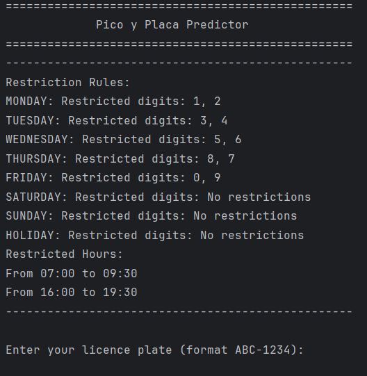
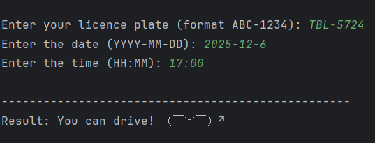
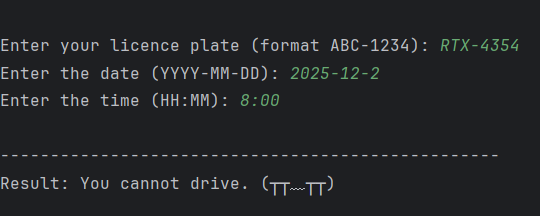

 # Pico y Placa Predictor

Simple command-line tool to predict whether a vehicle is allowed to circulate under "pico y placa" restrictions.

## Project Structure

- `src/`
  - `main.py`: Application entrypoint (CLI).
  - `core/`
    - `entities.py`: Core domain entities.
  - `interfaces/`
    - `restriction_strategy.py`: Strategy interface defining the contract for restriction calculation.
  - `services/`
    - `predictor.py`: Application service that coordinates strategies and core entities to produce predictions.
  - `strategies/`
    - `quito_strategy.py`: Concrete implementation of the restriction strategy for Quito, as specified in docs.
- `tests/`
  - `test_plate_predictor.py`: Unit tests for the prediction service and related components.
- `docs/`
  - Reference documents and diagrams.

## Design

This project applies the **Strategy** design pattern for restriction calculation.

- The `RestrictionStrategy` interface defines how restrictions must be evaluated.
- The `Predictor` service depends only on the strategy interface, not on concrete implementations.

**Why Strategy?**

Pico y placa restrictions may change over time (different schedules, special days, or cities). By using Strategy:

- New or updated rules are added as new strategy classes, without modifying other components.
- The codebase is easier to maintain.
- Behavior can be switched at runtime by providing a different strategy implementation.

## Testing

Unit tests are implemented with **pytest**.
To run the unit tests:

```bash
pytest
```

## CLI

### Usage



### Can Drive Example



### Restricted Example




